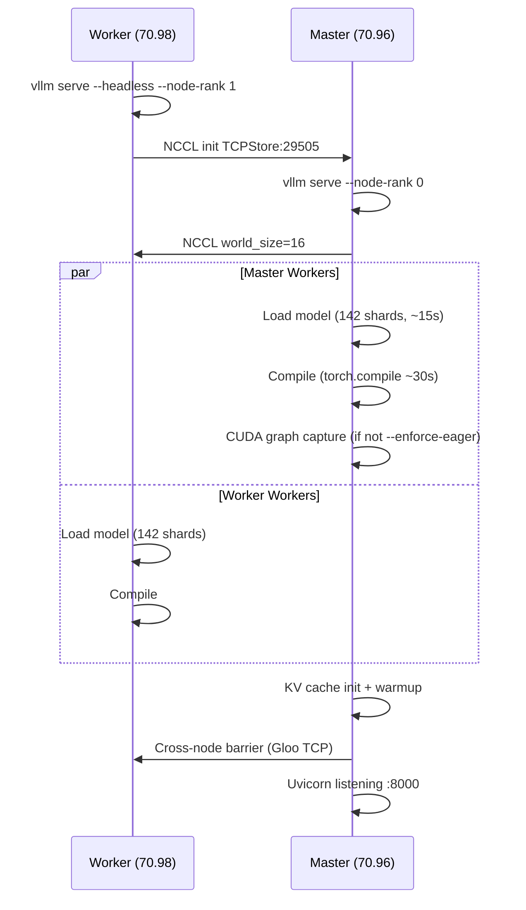

# Blackwell MLA Attention Backend — Debugging History

## Backend Compatibility Table (SM 12.0 / RTX PRO 6000 Blackwell)

| Backend | Dense/Sparse | fp8 kv | auto kv (bf16) | 8 q-heads | 128 q-heads | CC check | Result |
|---------|-------------|--------|-----------------|-----------|-------------|----------|--------|
| FLASH_ATTN_MLA | dense | ✗ no | ✗ no | ✓ | ✓ | ✗ CC 9 only | fails CC |
| FLASHMLA | dense | ✓ | ✓ | ✓ | ✓ | ✗ CC 9,10 | fails CC, not compiled |
| FLASHMLA_SPARSE | sparse | ✓ | ✓ | ✓ | ✓ | ✗ CC 9,10 | fails CC, not compiled |
| FLASHINFER_MLA | dense | ✓ | ✗ fp8 only | ✗ 128 req'd | ✓ | ✗ CC 10 only | 8 q-head fail |
| **FLASHINFER_MLA_SPARSE** | sparse | ✓ | ✗ **bf16 crash** / ✅ **fp8_e4m3** | ✓ | ✓ | ✓ CC 10,12 | **XQA fp8-only kernel** |
| CUTLASS_MLA | dense | ✓ | ✓ | ✓ | ✓ | ✗ CC 10 only | doesn't support DECODER attn |
| **TRITON_MLA** | dense | ✓ | ✓ **bf16 OK** | ✓ | ✓ | ✓ all CC | shared mem 102400 > 101376 on fp8 |
| — (DEEPGEMM MoE) | — | — | — | — | — | — | SM 12.0 unsupported |

## Key Blackwell MLA Finding (2026-06-02)

**FlashInfer sparse MLA (`FLASHINFER_MLA_SPARSE`) requires FP8 for BOTH query and
kv_cache** — passing bf16 for either causes:
```
ValueError: XQA MLA only supports fp8 operation on SM120/SM121 GPUs,
got torch.bfloat16 and torch.bfloat16
```

With `--kv-cache-dtype auto` (bf16 kv_cache), FlashInfer MLA (dense or sparse) receives
bf16 tensors and crashes. This is independent of `--enforce-eager`.

**TRITON_MLA** handles bf16 kv_cache correctly on Blackwell — the 100 KB shared
memory OOM is specific to the fp8 Triton MLA kernel path. With `--kv-cache-dtype auto`,
bf16 is used and TRITON_MLA works.

The sparse path is: `is_v32=True` → `use_sparse=True` → backend auto-select picks
`FLASHINFER_MLA_SPARSE` → crashes. To use sparse mode on Blackwell without FlashInfer,
need a different sparse backend or different kv_cache dtype.

## Error Signatures

### `XQA MLA only supports fp8 operation on SM120/SM121 GPUs, got torch.bfloat16 and torch.bfloat16`
- **Backend**: FLASHINFER_MLA (dense) AND FLASHINFER_MLA_SPARSE (sparse)
- **Cause**: FlashInfer's XQA MLA decode kernel on Blackwell only accepts FP8 input.
  With `--kv-cache-dtype auto`, kv_cache is bf16, so the kernel receives bf16 → crash.
- **Fix for sparse mode (GLM native on Blackwell)**: Use `--kv-cache-dtype fp8_e4m3`
  (not `auto` and not a different backend). The sparse backend auto-selection
  (`FLASHINFER_MLA_SPARSE`) cannot be overridden with `--attention-backend` in sparse
  mode — that fails validation. Only `--kv-cache-dtype fp8_e4m3` enables the
  `_decode_concat_quant_fp8_op` quantization path that produces FP8 Q tensors.
- **Fix for dense mode**: Use `--attention-backend TRITON_MLA` with `--kv-cache-dtype auto`
  (bf16 works with TRITON_MLA's bf16 kernel path on Blackwell).

### `outOfResources: out of resource: shared memory, Required: 102400, Hardware limit: 101376`
- **Backend**: TRITON_MLA
- **Cause**: Blackwell SM 12.0 has 99KB shared memory/block. Triton JIT'd fp8 decode kernel
  requests 100KB.
- **Fix**: Use `--kv-cache-dtype auto` (bf16) to avoid the fp8 kernel path. `--enforce-eager`
  does NOT fix this (the kernel is JIT-compiled at runtime, not at CUDA graph capture).

### `backendEnum.TRITON_MLA is not valid for this configuration. Reason: ['sparse not supported']`
- **Cause**: Sparse/-dense backend validation. When `use_sparse=True` and backend `is_sparse()=False`,
  backend is rejected. Can fire when TRITON_MLA is explicitly forced in sparse mode.
- **Fix**: Don't force TRITON_MLA when in sparse mode. Let auto-select choose (may hit XQA fp8 issue
  with FlashInfer sparse). Or remove sparse activation (`--hf-overrides '{"index_topk": null}'`).

### `block_tables must be 2D for shared paged KV layout, got ndim=3`
- **Backend**: FLASHINFER_MLA_SPARSE
- **Cause**: HND (Hybrid N-D) KV cache layout produces 3D page table. FlashInfer TRT-LLM kernel expects 2D.
- **Fix**: Use a different backend or force non-HND layout.

### `AttributeError: 'GlmMoeDsaForCausalLM' object has no attribute 'indexer'`
- **Trigger**: `--hf-overrides '{"index_topk": 0}'` disables indexer, but weight loader still tries to load indexer weights.
- **Fix**: Remove `--hf-overrides` entirely. Or patch `load_weights` to skip indexer weights when `self.indexer is None`.

## Startup Sequence

